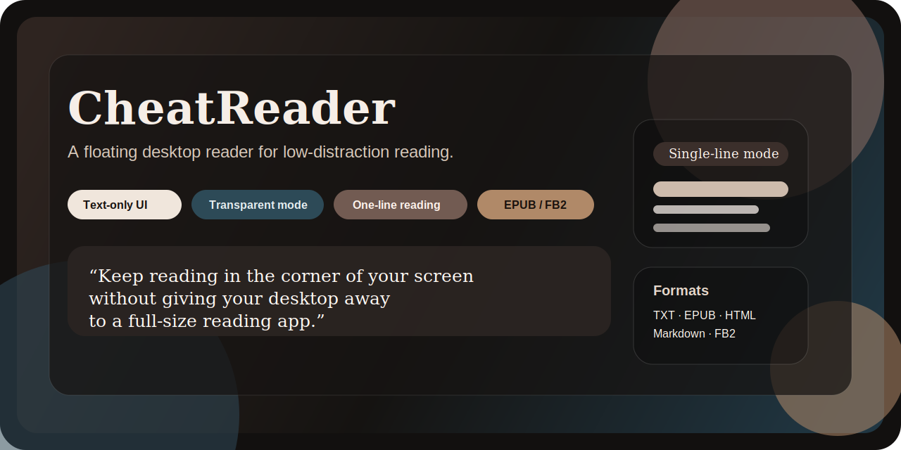

<p align="center">
  <strong>English</strong> · <a href="./README.zh-CN.md">简体中文</a>
</p>

<p align="center">
  
</p>

<p align="center">
  <strong>A floating desktop reader for low-distraction reading.</strong>
</p>

<p align="center">
  CheatReader keeps books visible in the corner of your screen without turning your desktop into a full reading app.
</p>

<p align="center">
  
  
  
  
</p>

## Why It Exists

Traditional reading apps want your full attention.
CheatReader does the opposite: it stays light, quiet, and easy to tuck into the edge of your workspace while you keep doing other things.

## Highlights

- Transparent text-only mode that lets the app disappear into your desktop
- Compact single-line and multi-line reading modes
- Configurable mode switching via double click, middle click, or keyboard shortcut
- Support for `txt`, `epub`, `html`, `markdown`, and `fb2`
- Local managed library copies so imported books still restore after restart
- Lightweight desktop-first reading flow with drag-and-drop import

## Platform Support

| Platform | Status | Notes |
| --- | --- | --- |
| macOS | Best supported | Transparent overlay mode is fully tuned here |
| Windows | Supported | Same reading flow, frameless desktop window, test recommended on target machine |
| Linux | Supported | Same reading flow, frameless desktop window, test recommended on target machine |

## Supported Formats

| Format | Status | Notes |
| --- | --- | --- |
| `txt` | Full | Encoding-aware plain text import |
| `epub` | Text extraction | Chapter text is extracted into the existing reader flow |
| `html` / `htm` / `xhtml` | Text extraction | Ignores page chrome and keeps readable body text |
| `md` / `markdown` | Text extraction | Strips markdown syntax into plain readable text |
| `fb2` | Text extraction | Pulls FictionBook section text into the reader |

## Run

```bash
flutter pub get
flutter run -d macos
```

### Install on macOS without an Apple Developer account

If you download the unsigned macOS app from GitHub Releases, macOS may block it the first time you launch it.

You can remove the quarantine flag in Terminal:

```bash
xattr -dr com.apple.quarantine /Applications/cheatreader.app
```

If you keep the app somewhere else, replace the path with the actual app location.

### Run on Windows

```bash
flutter config --enable-windows-desktop
flutter run -d windows
```

### Run on Linux

```bash
flutter config --enable-linux-desktop
flutter run -d linux
```

## Desktop Prerequisites

### Windows

- Flutter with Windows desktop enabled
- Visual Studio with Desktop development with C++

### Linux

- Flutter with Linux desktop enabled
- `clang`, `cmake`, `ninja-build`, `pkg-config`
- GTK development packages required by Flutter desktop

Typical Ubuntu/Debian setup:

```bash
sudo apt-get update
sudo apt-get install clang cmake ninja-build pkg-config libgtk-3-dev liblzma-dev
```

## Verify

```bash
flutter test
flutter analyze
```

You can also test platform builds directly:

```bash
flutter build windows
flutter build linux
```

## Releases

This repository is configured for automated desktop releases with GitHub Actions.

- Push a tag like `v0.1.0`
- GitHub Actions runs analyze and tests
- The workflow builds macOS, Windows, and Linux release artifacts
- GitHub Release assets are uploaded automatically

You can also trigger the workflow manually from the Actions tab with a tag name.

## Project Direction

CheatReader is intentionally opinionated:

- minimal chrome
- floating utility, not a bookshelf-heavy library app
- text-first extraction over perfect original-format rendering

That keeps the experience fast, calm, and easy to leave open all day.
