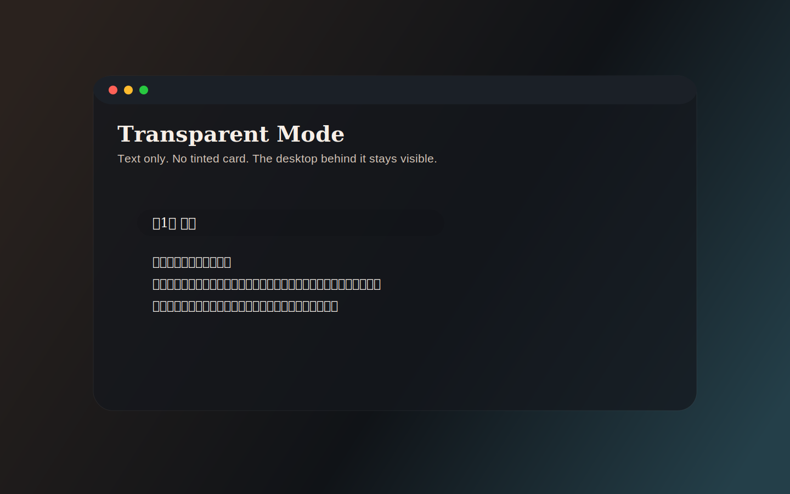

<p align="center">
  <a href="./README.md">English</a> · <strong>简体中文</strong>
</p>

<p align="center">
  
</p>

<p align="center">
  <strong>一个为低干扰阅读而设计的悬浮桌面阅读器。</strong>
</p>

<p align="center">
  CheatReader 让你在桌面角落继续读书，而不是把整个屏幕交给传统阅读应用。
</p>

<p align="center">
  
  
  
  
</p>

## 这个项目解决什么问题

大多数阅读器都希望你“进入阅读状态”，占据主要注意力。
CheatReader 的方向相反：它更轻、更安静、更适合挂在桌面边缘，让你在工作流里继续读。

## 亮点

- 真正的透明文字模式，只保留文字，不压背景块
- 单行 / 多行两种紧凑阅读模式
- 支持双击、中键、快捷键等切换方式
- 支持 `txt`、`epub`、`html`、`markdown`、`fb2`
- 导入后的本地托管副本，重启后仍能恢复阅读
- 面向桌面、低干扰、可拖拽导入的轻量阅读体验

<p align="center">
  
</p>

## 平台支持

| 平台 | 状态 | 说明 |
| --- | --- | --- |
| macOS | 支持最佳 | 透明模式在这里体验最完整 |
| Windows | 支持 | 采用同一套悬浮阅读逻辑，建议在目标机器上实测 |
| Linux | 支持 | 采用同一套悬浮阅读逻辑，建议在目标机器上实测 |

## 支持的格式

| 格式 | 支持情况 | 说明 |
| --- | --- | --- |
| `txt` | 完整支持 | 包含编码识别 |
| `epub` | 文本提取 | 抽取章节正文进入现有阅读流 |
| `html` / `htm` / `xhtml` | 文本提取 | 去掉页面外壳，只保留主体文本 |
| `md` / `markdown` | 文本提取 | 去掉 Markdown 语法后进入阅读 |
| `fb2` | 文本提取 | 提取 FictionBook 主体章节文本 |

## 运行

```bash
flutter pub get
flutter run -d macos
```

### macOS 安装说明（没有苹果开发者账号）

如果你是从 GitHub Releases 下载未签名的 macOS 应用，系统第一次打开时大概率会拦截。

可以在终端里去掉隔离属性：

```bash
xattr -dr com.apple.quarantine /Applications/cheatreader.app
```

如果你的 app 不在 `/Applications`，把后面的路径替换成你自己的实际位置即可。

### Windows

```bash
flutter config --enable-windows-desktop
flutter run -d windows
```

### Linux

```bash
flutter config --enable-linux-desktop
flutter run -d linux
```

## 桌面依赖

### Windows

- 已启用 Windows desktop 的 Flutter
- 安装了 Desktop development with C++ 的 Visual Studio

### Linux

- 已启用 Linux desktop 的 Flutter
- `clang`、`cmake`、`ninja-build`、`pkg-config`
- Flutter 桌面 GTK 相关开发包

Ubuntu / Debian 常见安装方式：

```bash
sudo apt-get update
sudo apt-get install clang cmake ninja-build pkg-config libgtk-3-dev liblzma-dev
```

## 校验

```bash
flutter test
flutter analyze
```

也可以直接验证桌面构建：

```bash
flutter build windows
flutter build linux
```

## Release

仓库已经配置了 GitHub Actions 自动桌面发版：

- 推送 `v0.1.0` 这种 tag
- 自动执行 analyze 和 test
- 自动构建 macOS / Windows / Linux 三端产物
- 自动上传到 GitHub Release

也可以在 Actions 页面手动触发，并指定 tag 名称。

## 项目方向

CheatReader 是一个带有明确取舍的项目：

- 尽量少的界面元素
- 更像桌面悬浮工具，而不是重书库管理器
- 优先做“文本提取后轻量阅读”，而不是复杂原样排版还原

这样它才足够轻、足够快，也足够适合长期挂在桌面边缘。
